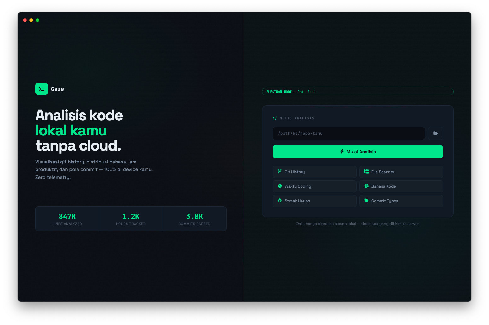
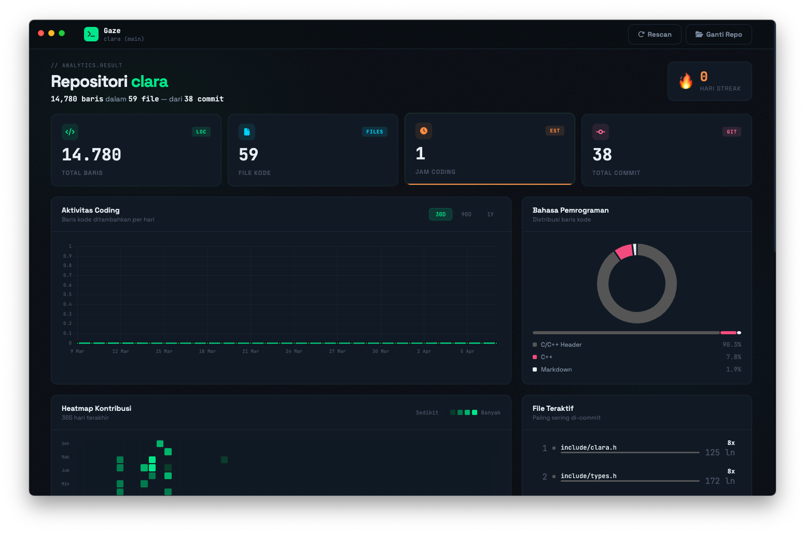
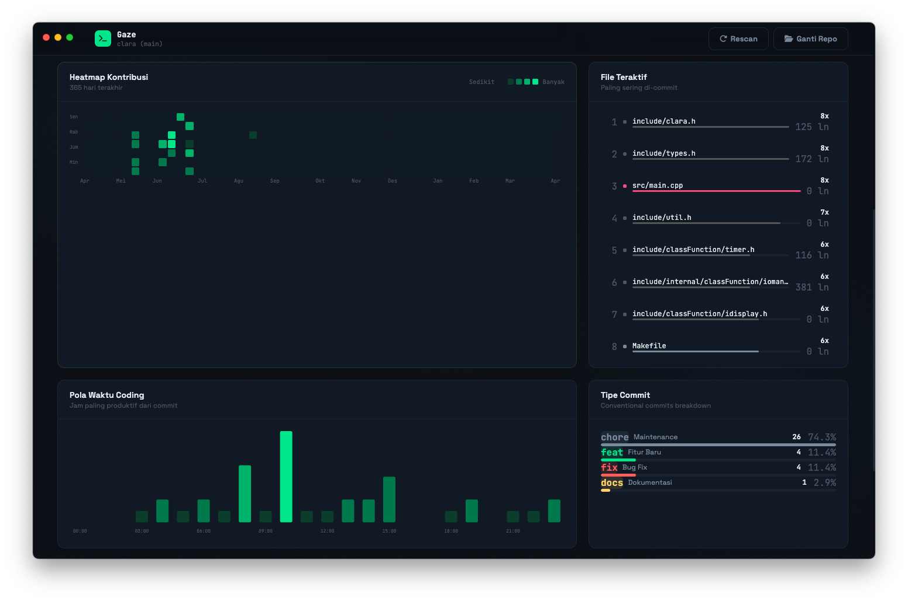
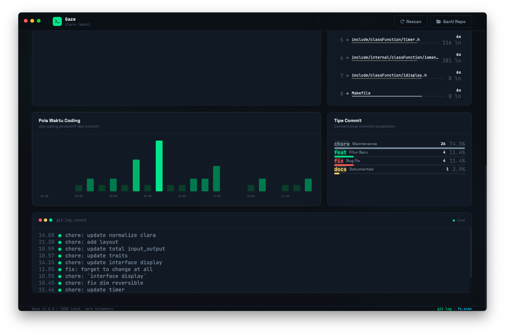

---

Gaze is a lightweight and efficient gaze tracking / monitoring project built with TypeScript.
It focuses on simplicity, performance, and clean architecture, making it suitable for experimentation and real-time applications.

The project is designed to be easy to understand and extend, while still providing a solid base for developing tracking or monitoring systems.

---

## Package used on Gaze

### Node.js

Node.js is used as the runtime environment to execute the application. It provides an event-driven architecture suitable for real-time systems.

website: https://nodejs.org/

---

### TypeScript

TypeScript is a strongly typed superset of JavaScript that improves developer experience and code reliability.

website: https://www.typescriptlang.org/

---

## Demo






https://github.com/user-attachments/assets/e1dde194-b165-4e71-8f1a-2fdb17350c86

---

## Installation

The installation is needs npm (node package manager)

```
git clone https://github.com/adtzslowy/gaze.git
cd gaze
npm install
```

---

## Running Gaze

This command is to running build and run the Gaze.

```
npm start
```

---

## Build

You can build this project for your own operating system.

* macOS
* Windows
* Linux

```
npm run dist:mac
npm run dist:win
npm run dist:linux
```

And if you wanna build for all opearting system you can use this command.

```
npm run dist:all
```

---

## Project Structure

```code
gaze/
├── .github/
├── src/
│   └── analytics.ts
│   └── constants.ts
│   └── git.ts
│   └── index.html
│   └── main.ts
│   └── preload.js
│   └── renderer.ts
│   └── scanner.ts
│   └── types.ts 
├── assets/
│   └── static files (images, etc)
├── README.md
├── LICENSE
├── .gitignore
├── package-lock.json
├── package.json
├── tsconfig.json
├── tsconfig.web.json
```

---

## Development Notes

* Keep the code simple and readable
* Avoid unnecessary dependencies
* Focus on performance and clarity

---

## Contributing

Gaze is open for contributions.

Before contributing, please:

* Fork the repository
* Create a new branch
* Follow the existing code style

Then submit a pull request.

---

## License

This project is licensed under the MIT License.
